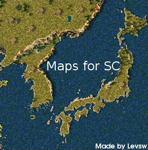
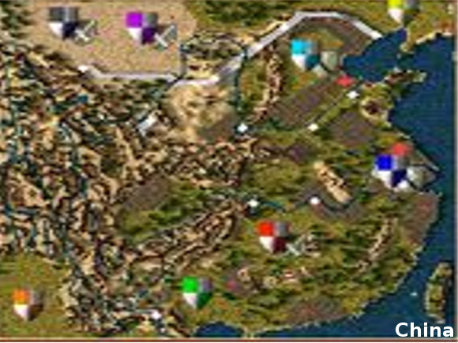
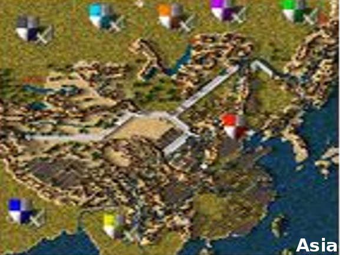
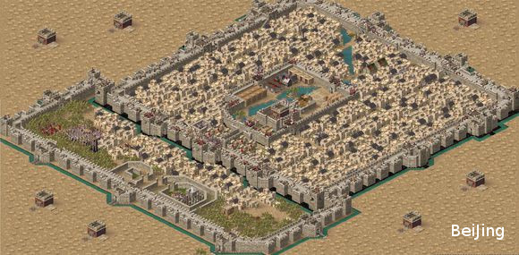

# Some maps for Stronghold Crusader
These maps paint from the map of real world by me.  
  
[This map on tieba](https://tieba.baidu.com/p/6027784104)  
# Images
## China

## Asia

## Beijing

# Name rules
China_X_：以汉地18省为主 X代表批次，批次不同地图略微不同
BeiJing_X_：以我的经典地图《北京城》为主 X代表批次，批次不同地图略微不同
_War：以历史上真实战役为主
Asia_：包含整个亚洲的地图为主
ChaoXian_：朝鲜半岛地形为主
O_：标准制图网格