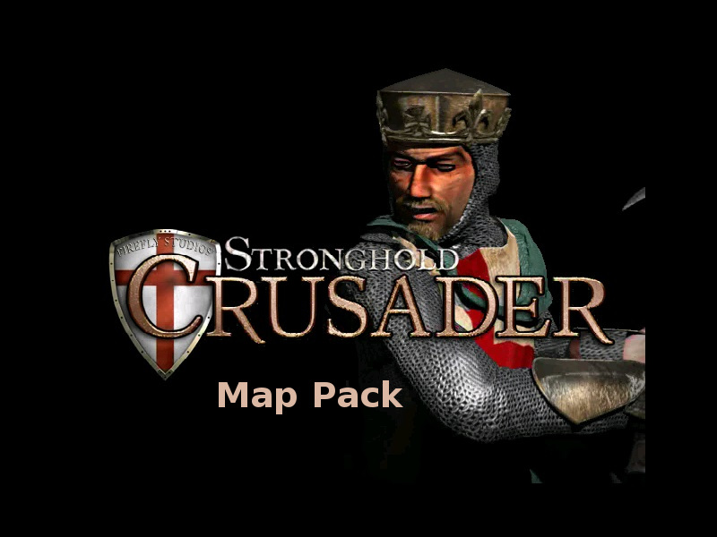
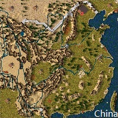
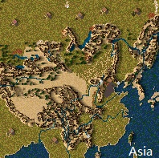
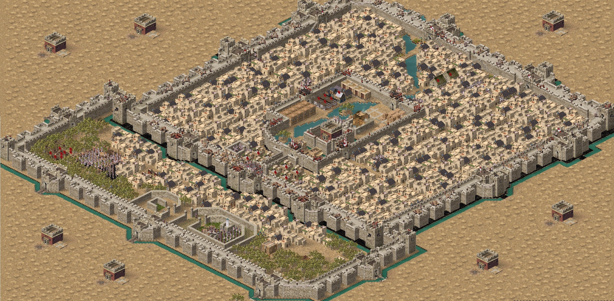
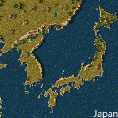
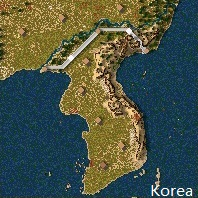

# Some maps for Stronghold Crusader
These maps paint from the map of real world by me.  
  
[This map on tieba](https://tieba.baidu.com/p/6027784104)  
# Images
## China

## Asia

## Beijing
  

## Japan

## Korea

# Name rules
China_X_：以汉地18省为主 X代表批次，批次不同地图略微不同  
BeiJing_X_：以我的经典地图《北京城》为主 X代表批次，批次不同地图略微不同  
_ War：以历史上真实战役为主  
Asia_：包含整个亚洲的地图为主  
ChaoXian_：朝鲜半岛地形为主  
O_：标准制图网格

China_X_: Based on 18 provinces in China's Ming Dynasty, X represents batches, and different batches of maps are slightly different.  
BeiJing_X_: Take my classic map "Beijing City" as the main X. Batches, batches of different maps are slightly different.  
_ War: Based on the real battle in history  
Asia_: Contains maps of Asia as a whole  
ChaoXian_: Topography of the Korean Peninsula  
O_: Standard Mapping Grid
