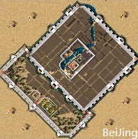

# Some maps for Stronghold Crusader
These maps paint from the map of real world by me.  
  
[This map on tieba](https://tieba.baidu.com/p/6027784104)

  

# Images
## China

## Asia

## Beijing
  
  
## Japan

## Korea

# Name rules
这个地图应用要塞十字军东征游戏版本为：v1.1版  
China_X_：以汉地18省为主 X代表批次，批次不同地图略微不同  
BeiJing_X_：以我的经典地图《北京城》为主 X代表批次，批次不同地图略微不同  
_ War：以历史上真实战役为主  
Asia_：包含整个亚洲的地图为主  
ChaoXian_：朝鲜半岛地形为主  
O_：标准制图网格  
FZ：提前发展  
HA：提前拥有军队  
JY：只许经营  
LA：只有少量军队  
MC：明代初年  
MM：明代末年  
NA：没有军队  
7C：战国7雄  
BJD：以明代北京为首都  
NJD：以明代南京为首都  
CvsJ：中日战争  
CvsK：国共战争  
QL：侵略战争

This map application StrongholdCrusader game is v1.1 version.  
China_X_: Based on 18 provinces in China's Ming Dynasty, X represents batches, and different batches of maps are slightly different.  
BeiJing_X_: Take my classic map "Beijing City" as the main X. Batches, batches of different maps are slightly different.  
_ War: Based on the real battle in history.  
Asia_: Contains maps of Asia as a whole.  
ChaoXian_: Topography of the Korean Peninsula.  
O_: Standard Mapping Grid.  
FZ: Advance development.  
HA: Own army in advance.  
JY: Only operation.  
LA: Only a small number of troops.  
MC: In the early Ming Dynasty.  
MM: In the last years of the Ming Dynasty.  
NA: None army.  
7C: The Seven Kingdoms of the Warring States.  
BJD: Take Beijing as the capital of the Ming Dynasty.  
NJD: Take Nanjing as the capital of the Ming Dynasty.  
CvsJ: The China-Japanese War.  
CvsK: The KMT-CCP War.  
QL: The war of aggression.
